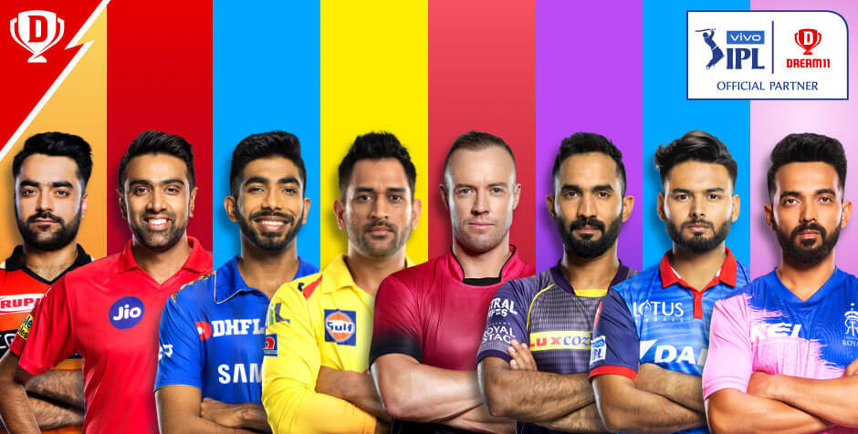

# IPL Analytics
IPL Analytics is a basic data analytics project that can be customized to find some interesting patterns in the Indian Premier League tournament. This repository contains data from the year 2008 until the year 2019. Feel free to suggest/contribute by finding new ideas for analysis. 

# Data Information 
We have two different CSV files that are imported as inputs. 
- matches.csv
- deliveries.csv

### Matches Data
- We have a total of 18 features in the Matches data, out of which 12 of them are categorical, 5 of them are numerical and 1 is a date field. 
- We had a few discrepancies with the data. I am listing them below for reference. 
	- city feature 
		- It had duplicate values for Bangalore (Bengaluru) and Chandigarh (Mohali)
		- It had 7 NA values, each of them had venue as Dubai. 
	- team1, team2, toss_winner, winner features
		- It had duplicate values for Rising Pune Supergiant team. 
	- winner feature
		- 4 NA values found for no result matches.
	- player_of_match feature
		- 4 NA values found for no result matches.
	- venue feature
		- It had a lot duplicate values.
			- Rajiv Gandhi International Stadium, Uppal vs Rajiv Gandhi Intl. Cricket Stadium (Hyderabad)
            - Punjab Cricket Association IS Bindra Stadium, Mohali vs Punjab Cricket Association Stadium, Mohali
            - M. A. Chidambaram Stadium vs MA Chidambaram Stadium, Chepauk
            - M Chinnaswamy Stadium vs M. Chinnaswamy Stadium
            - Feroz Shah Kotla vs Feroz Shah Kotla Ground
    - umpire1, umpire2 feature 
    	- 2 NA values found. 
    		- 2017-04-08 (index=4) u1 = Virender Sharma, u2 = Sundaram Ravi [link](https://www.espncricinfo.com/series/8048/scorecard/1082595/royal-challengers-bangalore-vs-delhi-daredevils-5th-match-indian-premier-league-2017)
            - 2019-08-05 (index=753) u1 = Bruce Oxenford, u2 = Sundaram Ravi [link](https://www.espncricinfo.com/series/8048/scorecard/1181766/delhi-capitals-vs-sunrisers-hyderabad-eliminator-indian-premier-league-2019)
- **I could reduce memory consumption by 30% just by typecasting the features to valid datatypes.**

### Deliveries Data
- We have a total of 21 features in the Deliveries data, out of which 8 of them are categorical and 13 of them are numerical. 
- We had a few discrepancies with the data. I am listing them below for reference. 
	- inning feature 
		- I have no idea how an innings can be 5. I could not understand this feature completely. 
	- batting_team, bowling_team features
		- It had duplicate values for Rising Pune Supergiant team. 
	- batting_team, bowling_team, batsman, non_striker, bowler, player_dismissed, fielder, dismissal_kind features
		- Typecasted to categories 
	- player_dismissed, dismissal_kind features
		- It only had 8834 non-null values. 
	- total_runs feature
		- It had a lot of entries where the value was more than 7. It had a lot of discrepancies
- **I could reduce memory consumption by 22% just by typecasting the features to valid datatypes.**

# Data Source 
- CricInfo 
- Kaggle
- CricSheet
- IPL T20 Official Website 

# Analysis so far!!

You can find the notebook [here](https://nbviewer.jupyter.org/github/djsbalakrishnan/IPL-Analytics/blob/master/notebooks/IPLAnalytics.ipynb)

#### Batsman Statistics
- [x] Most Runs 
- [x] Most Runs (over)
- [x] Most Fours
- [x] Most Fours (innings)
- [x] Most Sixes
- [x] Most Sixes (innings)
- [x] Most Fifties 
- [x] Most Centuries 
- [x] Hightest Scores (innings)
- [x] Best batsman in powerplay
- [x] Best batsman in death overs (last 4 overs)
- [x] Best Batting Strike Rate
- [x] Best Batting Average
- [x] Bowler vs Batsman Head to Head Competition
- [x] Best Partnerships (in Analyse IPL Data notebook)
- [x] Top 4 Batsman Score comparison 

#### Bowler Statistics
- [x] Bowler providing most extras
- [x] Most Wickets
- [x] Most Maidens
- [x] Most Dot Balls
- [x] Most Dot Balls (innings)
- [x] Most Runs Conceded (Innings)
- [x] Best Bowling Economy 
- [x] Best Bowling Economy (innings)
- [x] Best bowler in powerplay
- [x] Best bowler in death overs (last 4 overs)
- [x] Bowler Wicket Taking Kind Percentage
- [x] Best Bowling Innings

#### Feilder Statistics
- [x] Best Fielder 

# Contribution
PRs on Feature Requests, Bug fixes are welcome. Feel free to open an issue.

# License
[CC](https://creativecommons.org/licenses/by-nc-sa/4.0/)

# Disclaimer
This tool is only intended for personal use and is a simple demonstration. 